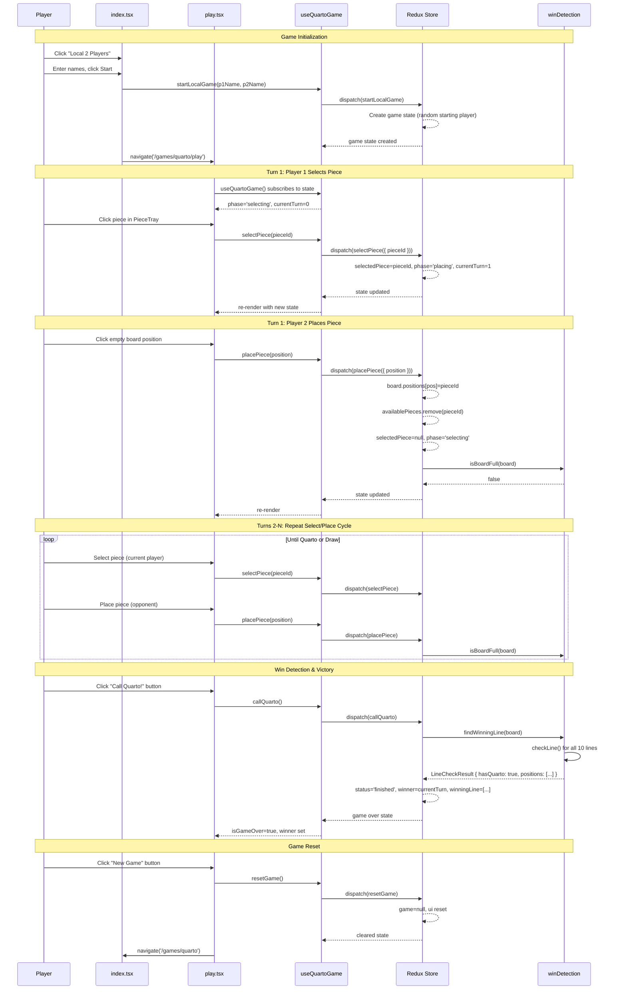
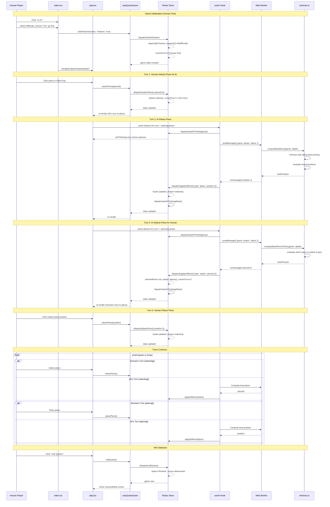

# Quarto Game Development Guide

**Feature**: 002-quarto-game
**Status**: MVP Complete (Phases 1-5)
**Last Updated**: 2025-12-05

---

## Table of Contents

1. [Project Overview](#project-overview)
2. [Architecture](#architecture)
3. [Data Model](#data-model)
4. [Redux Store](#redux-store)
5. [Core Utilities](#core-utilities)
6. [3D Components](#3d-components)
7. [UI Components](#ui-components)
8. [Routes](#routes)
9. [Hooks](#hooks)
10. [Testing](#testing)
11. [Future Phases](#future-phases)

---

## Project Overview

### What is Quarto?

Quarto is a strategic board game where two players compete on a 4x4 board with 16 unique pieces. Each piece has 4 binary attributes (color, shape, top, height), and players win by aligning 4 pieces that share any common attribute.

**Unique mechanic**: You don't place your own piece—you select a piece for your opponent to place!

### Tech Stack

| Technology | Purpose |
|------------|---------|
| React 19 | UI framework |
| TypeScript 5.x | Type safety |
| TanStack Start/Router | Full-stack framework, file-based routing |
| React Three Fiber + Drei | 3D rendering |
| Redux Toolkit | State management |
| React Spring | 3D animations |
| Vitest | Unit and integration testing |
| Zod | Runtime schema validation |

### Current Implementation Status

| Phase | Description | Status |
|-------|-------------|--------|
| 1 | Setup (directory structure, dependencies) | ✅ Complete |
| 2 | Foundational (types, utils, store, tests) | ✅ Complete |
| 3 | 3D View (Piece3D, Board3D) | ✅ Complete |
| 4 | Piece Selection (PieceTray, GameStatus) | ✅ Complete |
| 5 | Local 2-Player Game (complete loop) | ✅ Complete |
| 6 | AI Opponent (minimax algorithm) | 🔜 Pending |
| 7 | Online Multiplayer (WebSocket) | 🔜 Pending |
| 8 | Polish (accessibility, mobile, performance) | 🔜 Pending |

**Test Coverage**: 67 tests passing (54 unit + 13 integration)

---

## Architecture

### Directory Structure

```
app/features/quarto/
├── types/
│   └── quarto.types.ts          # TypeScript types and Zod schemas
├── store/
│   ├── quartoSlice.ts           # Redux slice with reducers
│   ├── selectors.ts             # Memoized Redux selectors
│   └── index.ts                 # Store exports
├── utils/
│   ├── pieceAttributes.ts       # Piece generation and attribute logic
│   ├── winDetection.ts          # Win detection and board utilities
│   └── index.ts                 # Utils exports
├── hooks/
│   ├── useQuartoGame.ts         # Main game orchestration hook
│   └── index.ts                 # Hooks exports
└── components/
    ├── Board3D.tsx              # 3D board visualization
    ├── Piece3D.tsx              # 3D piece visualization
    ├── PieceTray.tsx            # Available pieces display
    ├── GameStatus.tsx           # Turn indicator and messages
    ├── GameControls.tsx         # Action buttons
    └── index.ts                 # Components exports

app/routes/games/quarto/
├── index.tsx                    # Game menu (mode selection)
└── play.tsx                     # Game play view (3D canvas)

tests/
├── unit/quarto/
│   ├── pieceAttributes.test.ts  # 22 tests
│   └── winDetection.test.ts     # 32 tests
└── integration/quarto/
    └── gameFlow.test.ts         # 13 tests

specs/002-quarto-game/
├── spec.md                      # Feature specification
├── plan.md                      # Implementation plan
├── tasks.md                     # 73 task breakdown
├── data-model.md                # Entity definitions
├── research.md                  # Technology decisions
├── quickstart.md                # Developer setup guide
└── contracts/
    ├── api.md                   # REST/WebSocket contracts
    └── redux-actions.md         # Redux action contracts
```

### Data Flow

```
User Interaction
       │
       ▼
┌─────────────────┐
│   Components    │ ◄─── useQuartoGame() hook
│ (Board3D, etc.) │
└────────┬────────┘
         │
         ▼
┌─────────────────┐
│  Redux Store    │
│ (quartoSlice)   │
└────────┬────────┘
         │
         ▼
┌─────────────────┐
│   Selectors     │ ◄─── Memoized with createSelector
└────────┬────────┘
         │
         ▼
┌─────────────────┐
│    UI Update    │
└─────────────────┘
```

### Component Hierarchy

```
QuartoPlayPage
├── Canvas (React Three Fiber)
│   ├── Lighting (ambient, directional, point)
│   ├── Board3D
│   │   ├── Board surface
│   │   ├── Cell indentations
│   │   ├── Clickable zones
│   │   └── Piece3D (for each placed piece)
│   ├── PieceTray
│   │   └── Piece3D (for each available piece)
│   ├── ContactShadows
│   └── OrbitControls
└── Side Panel
    ├── GameStatus
    ├── GameControls
    └── Instructions
```

---

## Data Model

### Piece (4-bit Binary Encoding)

Each of the 16 pieces has 4 binary attributes, encoded into an ID (0-15):

```typescript
type PieceColor = 'light' | 'dark';       // Bit 0
type PieceShape = 'round' | 'square';     // Bit 1
type PieceTop = 'solid' | 'hollow';       // Bit 2
type PieceHeight = 'tall' | 'short';      // Bit 3

interface Piece {
  id: number;           // 0-15, derived from attributes
  color: PieceColor;
  shape: PieceShape;
  top: PieceTop;
  height: PieceHeight;
}
```

**ID Encoding Formula**:
```
id = (color === 'dark' ? 1 : 0)
   | (shape === 'square' ? 2 : 0)
   | (top === 'hollow' ? 4 : 0)
   | (height === 'tall' ? 8 : 0)
```

**Examples**:
- ID 0: light, round, solid, short (0000)
- ID 5: dark, round, hollow, short (0101)
- ID 15: dark, square, hollow, tall (1111)

### Board (4x4 Grid)

```typescript
type BoardPosition = number | null;  // Piece ID or empty

interface Board {
  positions: BoardPosition[];  // Fixed length 16
}
```

**Position Mapping**:
```
┌────┬────┬────┬────┐
│  0 │  1 │  2 │  3 │
├────┼────┼────┼────┤
│  4 │  5 │  6 │  7 │
├────┼────┼────┼────┤
│  8 │  9 │ 10 │ 11 │
├────┼────┼────┼────┤
│ 12 │ 13 │ 14 │ 15 │
└────┴────┴────┴────┘
```

### Game State

```typescript
interface Game {
  id: string;                           // UUID
  mode: 'local' | 'ai' | 'online';
  status: 'waiting' | 'playing' | 'finished';
  players: [Player, Player];
  board: Board;
  availablePieces: number[];            // IDs not yet placed
  currentTurn: 0 | 1;                   // Index into players
  phase: 'selecting' | 'placing';
  selectedPiece: number | null;         // Piece being placed
  winner: 0 | 1 | 'draw' | null;
  winningLine: number[] | null;         // 4 winning positions
  history: GameMove[];
  createdAt: number;
  updatedAt: number;
}

interface Player {
  id: string;
  type: 'human-local' | 'human-remote' | 'ai';
  name: string;
  difficulty?: 'easy' | 'medium' | 'hard';
}

interface GameMove {
  type: 'select' | 'place' | 'quarto';
  player: 0 | 1;
  pieceId?: number;
  position?: number;
  timestamp: number;
}
```

### Winning Lines (10 total)

```typescript
const WINNING_LINES: number[][] = [
  // 4 rows
  [0, 1, 2, 3], [4, 5, 6, 7], [8, 9, 10, 11], [12, 13, 14, 15],
  // 4 columns
  [0, 4, 8, 12], [1, 5, 9, 13], [2, 6, 10, 14], [3, 7, 11, 15],
  // 2 diagonals
  [0, 5, 10, 15], [3, 6, 9, 12]
];
```

---

## Redux Store

### State Shape

```typescript
interface QuartoState {
  game: Game | null;
  ui: {
    selectedPosition: number | null;    // Keyboard navigation
    hoveredPosition: number | null;     // Mouse hover
    isAIThinking: boolean;
    connectionStatus: 'disconnected' | 'connecting' | 'connected';
    error: string | null;
  };
}
```

### Actions

**Game Lifecycle**:
| Action | Payload | Description |
|--------|---------|-------------|
| `startLocalGame` | `{ player1Name, player2Name }` | Starts 2-player local game |
| `startAIGame` | `{ playerName, difficulty, playerGoesFirst }` | Starts vs AI game |
| `setOnlineGame` | `Game` | Sets state from server sync |
| `resetGame` | - | Clears game and UI state |

**Game Moves**:
| Action | Payload | Description |
|--------|---------|-------------|
| `selectPiece` | `{ pieceId }` | Player selects piece for opponent |
| `placePiece` | `{ position }` | Player places selected piece |
| `callQuarto` | - | Player claims victory |

**AI Actions**:
| Action | Payload | Description |
|--------|---------|-------------|
| `setAIThinking` | `boolean` | Toggle AI thinking state |
| `applyAIMove` | `{ type, pieceId?, position? }` | Apply computed AI move |

**UI Actions**:
| Action | Payload | Description |
|--------|---------|-------------|
| `setSelectedPosition` | `number \| null` | Keyboard highlight |
| `setHoveredPosition` | `number \| null` | Mouse hover |
| `setError` | `string \| null` | Error message |
| `setConnectionStatus` | `status` | Connection state |

### Selectors

All selectors are memoized with `createSelector`:

**Game State**:
- `selectGame`, `selectBoard`, `selectGameStatus`, `selectGamePhase`, `selectGameMode`
- `selectCurrentPlayer`, `selectOpponentPlayer`, `selectIsMyTurn(playerId)`
- `selectAvailablePieces`, `selectSelectedPiece`
- `selectWinner`, `selectWinnerPlayer`, `selectIsGameOver`, `selectIsPlaying`

**Win Detection**:
- `selectCanCallQuarto` - Boolean: valid Quarto exists
- `selectWinningLines` - Array of `LineCheckResult`

**Board Queries**:
- `selectEmptyPositions`, `selectPlacedPiecesCount`
- `selectMoveHistory`, `selectMoveCount`

**UI State**:
- `selectUI`, `selectSelectedPosition`, `selectHoveredPosition`
- `selectIsAIThinking`, `selectConnectionStatus`, `selectError`

---

## Core Utilities

### Piece Attributes (`pieceAttributes.ts`)

```typescript
// Generate all 16 pieces (called once)
generateAllPieces(): Piece[]

// Pre-generated immutable array
ALL_PIECES: readonly Piece[]

// Lookup
getPieceById(id: number): Piece | undefined
getPiecesById(ids: number[]): Piece[]

// Compute ID from attributes
computePieceId(color, shape, top, height): number

// Attribute analysis
findSharedAttributes(pieces: Piece[]): Array<keyof Piece>
hasSharedAttribute(pieces: Piece[]): boolean
```

### Win Detection (`winDetection.ts`)

```typescript
interface LineCheckResult {
  hasQuarto: boolean;
  positions: number[];
  sharedAttributes: Array<keyof Piece>;
}

// Line checking
checkLine(board: Board, linePositions: number[]): LineCheckResult
findWinningLine(board: Board): LineCheckResult | null
findAllWinningLines(board: Board): LineCheckResult[]
hasQuarto(board: Board): boolean

// Board state
isBoardFull(board: Board): boolean
getEmptyPositions(board: Board): number[]
getPlacedPieceCount(board: Board): number
createEmptyBoard(): Board
isValidPlacement(board: Board, position: number): boolean

// Coordinate helpers
positionToCoords(position: number): { row: number; col: number }
coordsToPosition(row: number, col: number): number
```

---

## 3D Components

### Piece3D

**Props**:
```typescript
interface Piece3DProps {
  piece: Piece;
  position: [number, number, number];
  isSelected?: boolean;
  isHovered?: boolean;
  onClick?: () => void;
  onPointerOver?: () => void;
  onPointerOut?: () => void;
}
```

**Visual Attributes**:
| Attribute | Light | Dark |
|-----------|-------|------|
| Color | #D4A574 (maple) | #5D3A1A (walnut) |

| Attribute | Value |
|-----------|-------|
| Base radius | 0.35 units |
| Short height | 0.6 units |
| Tall height | 1.0 units |
| Hollow depth | 0.2 units |

**Geometry**:
- **Round**: Cylinder body + hemisphere dome (solid) or cylinder indent (hollow)
- **Square**: Box body + flat cap (solid) or box indent (hollow)

**Animation** (React Spring):
- Selection: scale 1.0 → 1.15, y-position +0.2
- Hover: scale 1.0 → 1.05
- Config: `{ tension: 300, friction: 20 }`

**Materials**:
- `meshStandardMaterial` with wood-like properties
- Roughness: 0.7, Metalness: 0.1
- Emissive highlights for selection (#FFD700) and hover (#444444)

### Board3D

**Props**:
```typescript
interface Board3DProps {
  board: Board;
  onPositionClick?: (position: number) => void;
  onPositionHover?: (position: number | null) => void;
  selectedPosition?: number | null;
  hoveredPosition?: number | null;
  winningLine?: number[] | null;
}
```

**Dimensions**:
- Board size: 4.5 × 4.5 units
- Thickness: 0.3 units
- Cell size: 1.0 unit
- Indent radius: 0.42, depth: 0.08

**Colors**:
- Board surface: #8B4513 (saddle brown)
- Border: #5D3A1A (dark wood)
- Indents: #654321
- Winning highlight: #FFD700 (gold)
- Hover: #4CAF50 (green, 60% opacity)

**Render Layers** (memoized):
1. Board mesh (surface + border)
2. Cell indentations (16 cylinders)
3. Clickable zones (transparent, for empty positions)
4. Placed pieces (Piece3D components)

---

## UI Components

### PieceTray

Displays available pieces in a 4×4 grid offset from the board.

```typescript
interface PieceTrayProps {
  availablePieces: Piece[];
  selectedPieceId?: number | null;
  onPieceSelect?: (pieceId: number) => void;
  disabled?: boolean;
}
```

**Layout**: 4 pieces per row, 1.2 unit spacing, x-offset of 4 units from center.

### GameStatus

Shows current game state with contextual messaging.

```typescript
interface GameStatusProps {
  status: GameStatus;
  phase: TurnPhase;
  currentPlayer: Player | null;
  winner: Player | null;
  isDraw: boolean;
  isAIThinking: boolean;
  selectedPieceName?: string;
}
```

**Display States**:
- **Win**: Green background, winner name, "Quarto!" message
- **Draw**: Yellow background, "Board full" message
- **Waiting**: Blue background, room code prompt
- **AI Thinking**: Purple background, animated dots
- **Playing**: Current player, phase, instructions

### GameControls

Action buttons for game control.

```typescript
interface GameControlsProps {
  canCallQuarto: boolean;
  onCallQuarto: () => void;
  onNewGame: () => void;
  onQuit: () => void;
  isGameOver: boolean;
  disabled?: boolean;
}
```

**Buttons**:
- "Call Quarto!" - Gold gradient, only when `canCallQuarto`
- "New Game" - Green gradient, only when game over
- "Quit Game" / "Back to Menu" - Slate gray

---

## Routes

### Index Page (`/games/quarto`)

Game mode selection menu:

1. **Local 2 Players**
   - Enter player names (max 20 chars)
   - Dispatches `startLocalGame()`

2. **vs AI**
   - Enter player name
   - Select difficulty (easy/medium/hard)
   - Choose who goes first
   - Dispatches `startAIGame()`

3. **Online Multiplayer** (disabled, coming soon)

### Play Page (`/games/quarto/play`)

Full 3D game view:

**Canvas Configuration**:
```javascript
camera={{ position: [8, 8, 8], fov: 45, near: 0.1, far: 100 }}
```

**Lighting**:
- Ambient: 0.4 intensity
- Directional: [10, 15, 10], 1.0 intensity, shadows
- Point: [-10, 10, -10], 0.3 intensity

**Controls**:
- OrbitControls: No pan, distance 6-20, elevation 30°-72°
- ContactShadows for ground shadows

**Side Panel** (w-80):
- Title, error display, GameStatus, GameControls, instructions

---

## Hooks

### useQuartoGame

The main game orchestration hook connecting components to Redux:

```typescript
function useQuartoGame() {
  // State (from selectors)
  game, board, currentPlayer, availablePieces, selectedPiece,
  canCallQuarto, winningPositions, isGameOver, isDraw, winner,
  winnerPlayer, phase, status, isPlaying, isWaiting, isAIThinking,
  error, hoveredPosition, selectedPosition,

  // Derived
  selectedPieceDescription,  // e.g., "dark, square, hollow, tall"

  // Actions (memoized callbacks)
  startLocalGame(player1Name, player2Name),
  startAIGame(playerName, difficulty, playerGoesFirst),
  resetGame(),
  selectPiece(pieceId),      // Guarded by phase check
  placePiece(position),      // Guarded by phase check
  callQuarto(),              // Guarded by canCallQuarto
  hoverPosition(position | null),
  clearError(),
}
```

---

## Testing

### Unit Tests

**pieceAttributes.test.ts** (22 tests):
- Piece generation: 16 unique pieces with correct IDs
- Binary encoding: Attribute-to-ID mapping
- ID computation: `computePieceId()` correctness
- Lookup functions: `getPieceById()`, `getPiecesById()`
- Shared attributes: `findSharedAttributes()`, `hasSharedAttribute()`
- Immutability: `ALL_PIECES` is frozen

**winDetection.test.ts** (32 tests):
- Board creation: Empty board with 16 null positions
- Line checking: Rows, columns, diagonals, anti-diagonals
- Quarto detection: All 4 attribute types
- No Quarto: Pieces with no shared attributes
- Board state: Full board, empty positions, placed count
- Position validation: Bounds checking, occupancy
- Coordinate conversion: Position ↔ row/col

### Integration Tests

**gameFlow.test.ts** (13 tests):
- Game initialization: Correct mode, players, random starting player
- Move validation: Selecting, placing, invalid moves
- Turn management: Phase switching, turn switching
- Win conditions: Valid Quarto call, invalid Quarto rejection
- Draw detection: Full board with no Quarto
- Complete game: End-to-end victory scenario
- Game reset: State cleanup

### Running Tests

```bash
# All Quarto tests
pnpm test tests/unit/quarto tests/integration/quarto --run

# Specific file
pnpm test tests/unit/quarto/winDetection.test.ts --run

# Watch mode
pnpm test tests/unit/quarto --watch
```

---

## Future Phases

### Phase 6: AI Opponent (P2)

**Tasks**:
- Implement board evaluation heuristics
- Implement minimax with alpha-beta pruning
- Create Web Worker wrapper for AI computation
- Add difficulty levels (depth 2/4/6)
- Implement `useAI` hook
- Add AI thinking indicator

**Key Files to Create**:
- `app/features/quarto/ai/evaluation.ts`
- `app/features/quarto/ai/minimax.ts`
- `app/features/quarto/ai/worker.ts`
- `app/features/quarto/hooks/useAI.ts`

### Phase 7: Online Multiplayer (P3)

**Tasks**:
- Implement room creation/join REST endpoints
- Implement WebSocket connection handler
- Implement message routing (SELECT_PIECE, PLACE_PIECE, etc.)
- Create `useMultiplayer` hook
- Add lobby UI with room codes
- Implement reconnection logic

**Key Files to Create**:
- `app/server/api/quarto/room.ts`
- `app/server/api/quarto/websocket.ts`
- `app/features/quarto/hooks/useMultiplayer.ts`
- `app/routes/games/quarto/lobby.tsx`

### Phase 8: Polish

**Accessibility**:
- ARIA live regions for state announcements
- Keyboard navigation (Tab, Enter, Arrow keys)
- Reduced motion mode

**Performance**:
- Instanced meshes for pieces (if needed)
- Code splitting / lazy loading
- Lighthouse audit

**Mobile**:
- Touch controls for piece selection
- Responsive layout adjustments

---

## Quick Reference

### Game Flow

```
1. Start Game
   └─► startLocalGame() or startAIGame()

2. Selecting Phase (currentPlayer)
   └─► Player picks piece from tray
   └─► selectPiece(pieceId)
   └─► Phase → 'placing', Turn switches

3. Placing Phase (opponent)
   └─► Opponent places piece on board
   └─► placePiece(position)
   └─► Phase → 'selecting'
   └─► Check for draw (board full)

4. Win Detection
   └─► Any time: callQuarto()
   └─► If valid line exists → Game ends, winner set
   └─► If no line → Error displayed

5. Game Over
   └─► status: 'finished'
   └─► winner: 0 | 1 | 'draw'
   └─► resetGame() to return to menu
```

### Key Commands

```bash
# Development
pnpm dev                    # Start dev server at :3000

# Testing
pnpm test                   # Run all tests
pnpm typecheck              # TypeScript check

# Navigation
http://localhost:3000/games/quarto       # Game menu
http://localhost:3000/games/quarto/play  # Game play
```

---

## Sequence Diagrams

### Local 2-Player Game Flow

The following diagram shows the complete method invocation sequence for a local 2-player game, from initialization through victory:



### Human vs AI Game Flow

The following diagram shows the method invocation sequence for a game against the AI opponent, highlighting the asynchronous AI computation in a Web Worker:



### AI-Specific Method Signatures

| Method | Location | Parameters | Effect |
|--------|----------|------------|--------|
| `startAIGame` | quartoSlice.ts | `{ playerName, difficulty, playerGoesFirst }` | Creates game with AI opponent |
| `setAIThinking` | quartoSlice.ts | `boolean` | Shows/hides AI thinking indicator |
| `applyAIMove` | quartoSlice.ts | `{ type, pieceId?, position? }` | Applies AI's computed move |
| `computeBestMove` | minimax.ts | `game, depth` | Minimax search for optimal move |
| `evaluateBoard` | evaluation.ts | `board` | Heuristic board scoring |

### AI Difficulty Levels

| Difficulty | Search Depth | Behavior |
|------------|--------------|----------|
| Easy | 2 | Makes occasional mistakes, beatable |
| Medium | 4 | Decent strategy, challenging |
| Hard | 6 | Near-optimal play, very difficult |

### Key Method Signatures

| Method | Location | Parameters | Effect |
|--------|----------|------------|--------|
| `startLocalGame` | quartoSlice.ts | `{ player1Name, player2Name }` | Creates game, random starting player |
| `selectPiece` | quartoSlice.ts | `{ pieceId }` | Sets selectedPiece, switches turn, phase→'placing' |
| `placePiece` | quartoSlice.ts | `{ position }` | Places piece on board, phase→'selecting' |
| `callQuarto` | quartoSlice.ts | - | Validates win, sets winner if valid |
| `findWinningLine` | winDetection.ts | `board` | Returns first winning line or null |
| `resetGame` | quartoSlice.ts | - | Clears game state |

### State Transitions

```
┌─────────────────────────────────────────────────────────────────┐
│                        GAME LIFECYCLE                           │
├─────────────────────────────────────────────────────────────────┤
│                                                                 │
│   null ─────► startLocalGame() ─────► { status: 'playing' }    │
│                                              │                  │
│                                              ▼                  │
│                                    ┌─────────────────┐          │
│                                    │    TURN LOOP    │          │
│                                    │                 │          │
│   ┌──────────────────────────────►│ phase: selecting│          │
│   │                                │ (current player)│          │
│   │                                └────────┬────────┘          │
│   │                                         │                   │
│   │                              selectPiece(pieceId)           │
│   │                                         │                   │
│   │                                         ▼                   │
│   │                                ┌─────────────────┐          │
│   │                                │ phase: placing  │          │
│   │                                │ (opponent)      │          │
│   │                                └────────┬────────┘          │
│   │                                         │                   │
│   │                              placePiece(position)           │
│   │                                         │                   │
│   └─────────────────────────────────────────┘                   │
│                                              │                  │
│                              callQuarto() ───┼─── isBoardFull()│
│                                   │          │          │       │
│                              (win found)   (no)    (full=draw) │
│                                   │                     │       │
│                                   ▼                     ▼       │
│                          { status: 'finished' }                 │
│                          { winner: 0|1|'draw' }                 │
│                                   │                             │
│                              resetGame()                        │
│                                   │                             │
│                                   ▼                             │
│                                 null                            │
│                                                                 │
└─────────────────────────────────────────────────────────────────┘
```

---

*This guide documents the MVP implementation of the Quarto board game. For specification details, see `/specs/002-quarto-game/`.*
